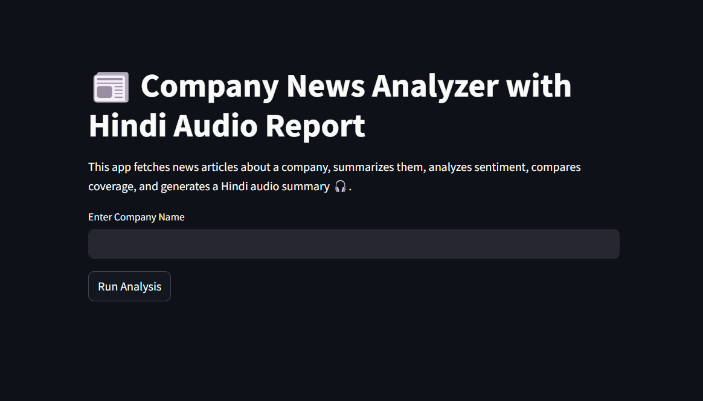

# News Summarization and Sentiment Analysis Application



## Overview

This application performs news summarization, sentiment analysis, comparative analysis, and generates Hindi audio summaries using text-to-speech. Users can input a company name and receive a structured sentiment report, along with a playable audio output in Hindi.

The solution is designed as part of an internship assignment to demonstrate end-to-end software development involving web scraping, NLP, API design, and deployment.

## Features

- Extract news articles related to a given company using Bing RSS feeds.
- Summarize each article using LexRank extractive summarization.
- Perform sentiment analysis using a transformer-based RoBERTa model.
- Conduct comparative sentiment and topic analysis across articles.
- Generate a Hindi audio summary using gTTS.
- Expose APIs via FastAPI for frontend-backend interaction.
- Simple frontend interface using Streamlit.
- Deployable via Docker or on Hugging Face Spaces.


## Setup Instructions
Follow these steps to run the project:
1. Clone the Repository:
```
git clone https://github.com/karenrenac/News-Summarization-with-TTS-Application.git
cd News-Summarization-with-TTS-Application
```
2. Install Dependencies
```
pip install -r requirements.txt
```
3. Run the Backend API (FastAPI):
```
uvicorn api:app --reload
```
Visit http://localhost:8000/docs to view the interactive API documentation (Swagger UI).

4. Run the Frontend (Streamlit):
```
streamlit run app.py
```

### Running with Docker (Optional)
1. Build Docker Image
```
docker build -t news-summarizer .
```
2. Run Docker Container
```
docker run -p 8080:8080 news-summarizer
```

## Models and Tools Used
* Summarization: LexRank algorithm via sumy library.
* Sentiment Analysis: cardiffnlp/twitter-roberta-base-sentiment-latest transformer model using HuggingFace transformers.
* Text-to-Speech (TTS): Hindi audio generated using gTTS.
* Topic Analysis: Extracted using keyword filtering and Sentence-BERT embeddings.
* Web Scraping: RSS feed parsing using feedparser and BeautifulSoup.

## API Details
The backend is developed using FastAPI and exposes endpoints to:

* That handle news scraping, summarization, sentiment analysis, topic extraction, and audio generation.
* When a company name is submitted, the API fetches relevant news articles via RSS feeds and summarizes them using the LexRank algorithm.
* Sentiment analysis is performed using a RoBERTa transformer model, and key topics are extracted using SBERT embeddings and keyword filtering.
* The API returns a structured JSON response containing article titles, summaries, sentiment scores, topic overlaps, and comparative analysis insights.
* The API is documented via Swagger UI at /docs, making it easy to test endpoints via Postman or integrate with the frontend application.

## Architecture & Deployment Strategy
### Monorepo Structure
This project is built as a monorepo containing both frontend and backend codebases within a single repository. The goal was to maintain a modular structure while ensuring easy local development.

### Dual Deployment (Hugging Face Spaces)
To meet Hugging Face’s infrastructure constraints (which allow only one runtime per Space), the application was architected into two separate Spaces — one for the backend API and another for the frontend UI. The backend is a Dockerized FastAPI service that handles all the heavy lifting like scraping, summarization, sentiment analysis, and TTS generation. The frontend is a Streamlit application that interacts with the backend via REST APIs. This decoupled setup ensures modularity, cleaner deployments, and better scalability for future enhancements.

* Frontend (Streamlit UI): https://huggingface.co/spaces/karenrena/newslytics
* Backend (FastAPI Docker API): https://huggingface.co/spaces/karenrena/newslytics-api

## Assumptions & Limitations
* News sources are fetched via Bing RSS feeds, which limits coverage to sources indexed by Bing and excludes JavaScript-heavy websites.
* Summarization is extractive only using LexRank, not abstractive or generative.
* Hindi audio generation is done using gTTS (Google Text-to-Speech), which relies on an undocumented Google Translate API endpoint. This works fine locally but is prone to rate-limiting (HTTP 429 errors) on shared cloud environments like Hugging Face Spaces, as Google may block requests from shared IPs.
* The TTS solution is basic and not production-grade. For large-scale deployment or reliability, open-source TTS engines like Coqui TTS, XTTS, or Festival are recommended alternatives.
* The application is built as a proof-of-concept for demonstration purposes and does not include advanced error-handling, authentication, or production-grade scaling mechanisms.